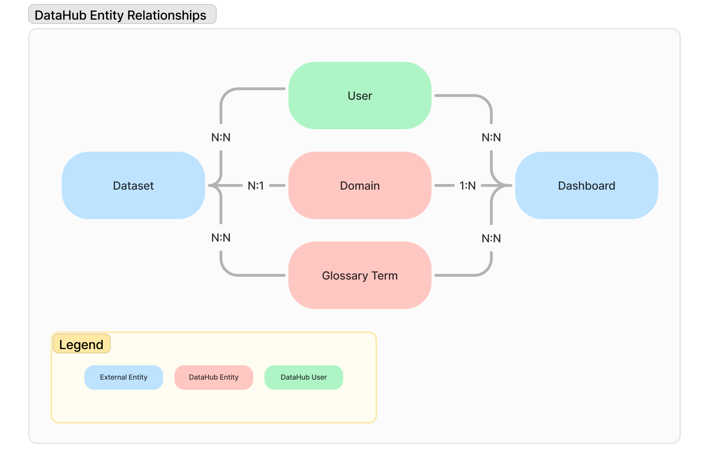

# Sr Analytics Engineer Assignment

## Introduction
DataHub is the leading open-source metadata platform that helps organizations catalog, discover, and understand their data assets. Used by over 3,000 companies worldwide, DataHub connects metadata across diverse data assets - from datasets and pipelines to dashboards and ML models - providing a unified approach to data discovery, observability, and governance.

Acryl Data is the company behind the project, offering a premium version of DataHub to customers like Notion, Chime, TripAdvisor, Optum, and more. 

## Assignment Overview

This assignment simulates the work you'll do as the first Senior Analytics Engineer at Acryl Data, focused on building high-quality data models on top of DataHub's metadata graph to understand customer adoption.

It contains two parts:

1. **Code Review:** Provide a code review of 3 SQL queries in the `/analyses` directory.
2. **Data Modeling:** Design a collection of data models on top of the staging table to support a wide range of analytical use cases.

Your submission should include:
- Your Forked GitHub repo with fully reproducible code for Parts 1 & 2 
- Comprehensive documentation covering your approach, assumptions, tradeoffs, and open questions

Please keep in mind the following:
- Deep expertise in DataHub's metadata model isn't required - the sample data is representative but simplified.
- All submissions will be evaluated using DuckDB; if you decide to use a different database, your submission must provide instructions on how to reproduce the code.

## Part 0: Get Familiar with the dbt Project

Here's what you'll find in this dbt project:

- `requirements.txt`: baseline versioned packages for building this dbt project to run against a local DuckDB database
- `seeds/datahub_entities_raw.csv`: A seed file representing DataHub's raw data model (reference only)
- `models/staging/stg_datahub_entities.sql`: Initial transformation of the seed file; this is the baseline model you'll be working with. See below image for entity relationships.
- `models/schema.yml`: Table and column descriptions
- `profiles.yml`: Default configuration to connect to local DuckDB database
- `dev.duckdb`: Database containing the `datahub_entities_raw` and `stg_datahub_entities` tables

Here are some commands to get your project running:

```
# Install dependencies
pip install -r requirements.txt
```

```
# Initialize and compile the dbt project
dbt compile

# Seed the project with the data from the seed files
dbt seed

# Run the models in the project
dbt run

# Generate dbt Docs
dbt docs generate

# View dbt Docs
dbt docs serve
```

```
# Open the DuckDB CLI with the database file
duckdb dev.duckdb
```

Once you have successfully compiled & built the project, take some time to get familiar with the contents of and documentation for `stg_datahub_entities`. Here's an overview of how entities within this table relate to one another:



## Part 1: Code Review

Within your GitHub Fork, create a pull request with improvements to the 3 files in the `analyses/` directory, focusing on the following:

1. **Logic Accuracy:** Ensure the query logic accurately generates output to address the questions listed at the beginning of each file; update the baseline query output if necessary.
2. **Consistency & Readability:** Suggest changes to improve consistency and readability of logic across all three files.
3. **Communication:** Explain why you are proposing the changes within your PR; add code comments inline where you feel they add value.

## Part 2: Analytical Data Model Design

Now that you are familiar with the underlying data and sample use cases, design a set of reusable dbt models built on top of `stg_datahub_entities` to address analytical needs and enable broader insights. These models can be merged directly into `main` or submitted as a Pull Request. Your models should:

1. **Support Existing Analyses**: Build models to answer questions from the `analyses` directory:
   - Domains assigned to Datasets/Dashboards, their descriptions, and count of assigned entities.
   - Glossary Terms applied to Datasets/Dashboards and count of assigned entities.
   - Owners assigned to Datasets/Dashboards, their job titles, and ownership counts.

2. **Focus on Usability and Deeper Insights**: Build models that are intuitive, easy to drill into, and designed for iteration, with clear field names and consistent structure. These models should facilitate analysis of intersections and relationships across **Domains**, **Ownership**, and **Glossary Terms**, such as:
   - Datasets tagged with specific Domains _and_ Glossary Terms.
   - Ownership patterns correlated with Domains _and/or_ Glossary Terms.

3. **Document Your Work**: Provide clear documentation on assumptions, trade-offs, and opportunities for improvement.

**Note**: Optimize for clarity and usability over performance. Incremental models are optional unless they enhance your design. Deliver clean, testable, and reusable models aligned with dbt best practices.